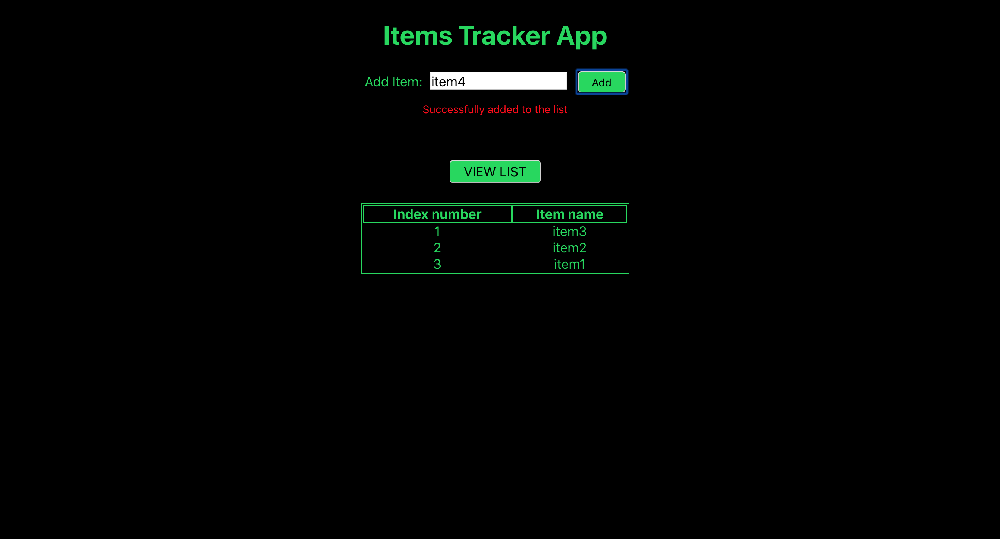

# Serverless-application
This codebase has been created to set up a full serverless application stack, where users will be able to add items to a list and view this list.

# Brief Overview ###
User can create an item object and view all items. 

- View all the created items stored in backend
- Add a new item

Developed Application is already deployed in AWS Platform with my credentials, you can access lambda functions to add new item and to get all items from below URL:

To Add New item: `https://26ggy7h8p5.execute-api.eu-central-1.amazonaws.com/dev/addItems`

To get all items: `https://26ggy7h8p5.execute-api.eu-central-1.amazonaws.com/dev/getItems`

### Technology Stack ###
Serverless-Backend: NodeJS, AWS Lambda, DynamoDB
Frontend: HTML, CSS, ReactJS

For more information on how this works with other frontends/backends, clone this repo and follow instructions.

### Getting Started ###
These instructions will get you a copy of the project up and running on your local machine.

### Prerequisites ###
Nodejs

AWS

Serverless

### Development Setup ###
Explain how to install all development dependencies.

`git clone https://github.com/himanshunagda/serverless-application`

 `cd serverless-application`
 
 `npm i`

### Install Dependencies ###
1) Install serverless:

`npm install -g serverless`

 ### Start the Development server ###
 `npm start`
 
 It starts project on http://localhost:3000/
 
 ### Basic Steps ###
 - Once development server is running, an UI can be accessed on URL http://localhost:3000/
 - Add new items.
 - Get all items.
 
Note: If you want to deploy serverless application in your AWS platform, follow these instructions below:

  1) Setup IAM user at https://aws.amazon.com/ to get AWS access ID and secret key.

  2) Configure your ACCESS_ID and Secret key to serverless with the command:

     `serverless config credentials --provider aws --key YOU_ACCESS_KEY --secret YOUR_SECRET_KEY `

  3) Navigate to serverless-application/backend and run these command to deploy: `serverless deploy` or `sls deploy`

  4) Once application is deployed, we get 2 endpoints POST and GET.

  5) Update the variables post_url and get_url in serverless-application/src/App.js with POST and GET Url we got before.

  6) Navigate to serverless-application and run `npm start`.

  7) Access your user interface on http://localhost:3000/